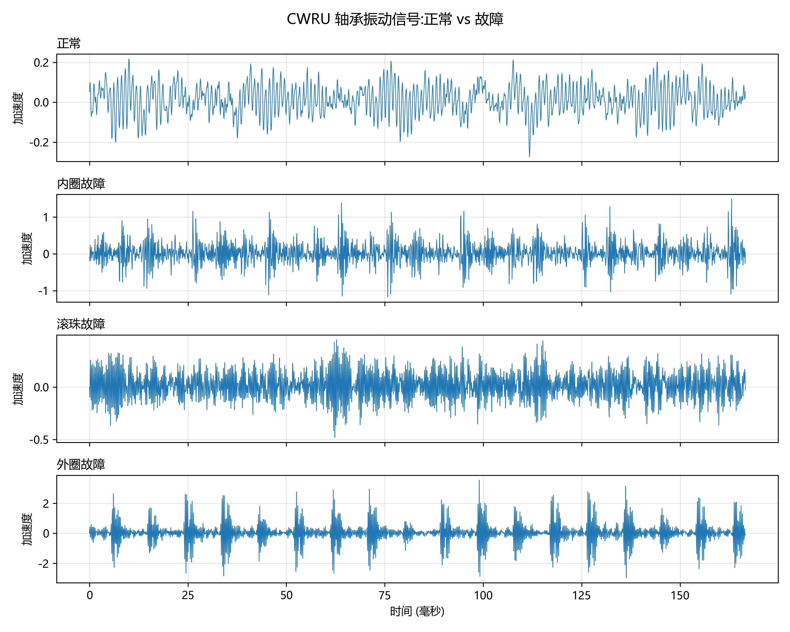
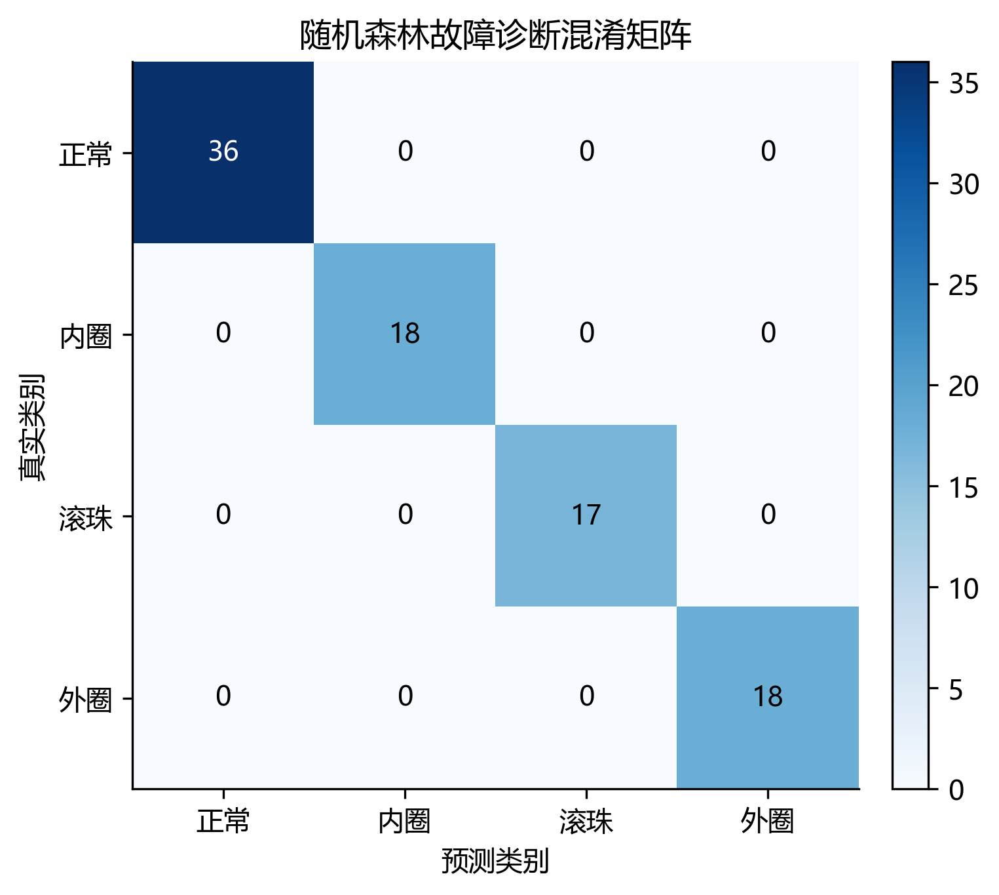
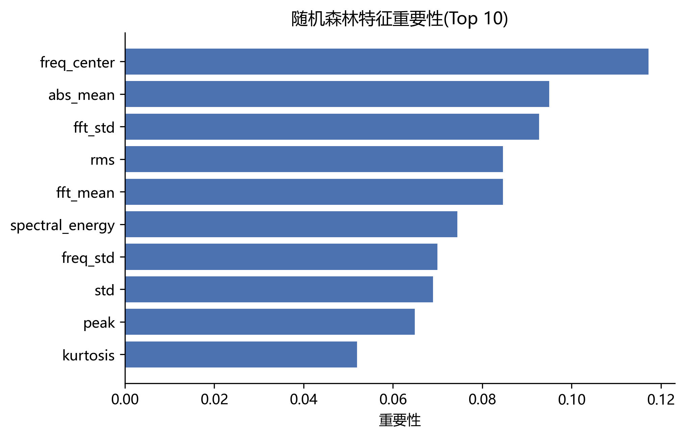
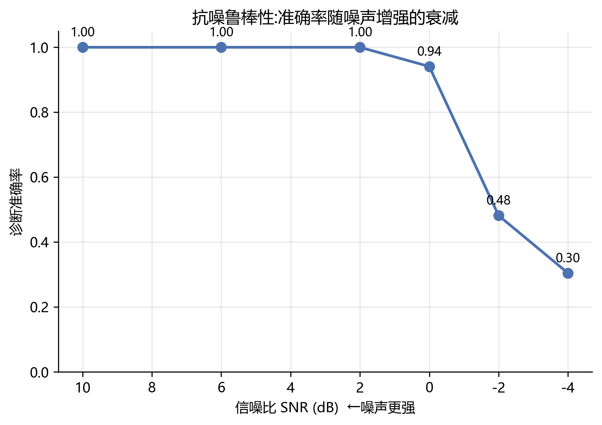

# 基于真实振动数据的电机轴承故障诊断系统

> 用 CWRU 真实轴承振动数据集,通过信号特征工程 + 机器学习,实现电机轴承四类状态(正常 / 内圈 / 滚珠 / 外圈故障)的智能诊断,并完成跨工况泛化与抗噪鲁棒性评估。

**技术栈:** Python · NumPy · Pandas · SciPy · scikit-learn · Matplotlib · Streamlit

---

## 1. 项目演进(重要)

本项目分两个阶段,演进过程本身是项目的一部分:

| 版本 | 数据来源 | 状态 | 说明 |
|------|---------|------|------|
| **v1** | 规则生成的模拟数据 | 已完成,保留为基线 | 搭建了完整的数据→特征→模型→看板 pipeline,验证了流程可行性 |
| **v2** | CWRU 真实轴承振动数据 | 当前版本 | 接入真实信号,重做特征工程与严格评估 |

**为什么要做 v2:** v1 的模拟数据是用规则(if-else 阈值)生成的,而机器学习模型又去学习这套规则,本质是"自己出题自己答",准确率虚高、不能反映真实诊断能力。v2 改用真实振动信号,从根本上解决了这个问题。

> v1 相关脚本(`src/data_generate.py`、`src/rule_warning.py`、`src/ml_model.py` 等)保留在仓库中,作为方法演进的基线参照。

---

## 2. 数据集

[CWRU 凯斯西储大学轴承数据中心](https://engineering.case.edu/bearingdatacenter)公开数据,是轴承故障诊断领域的标准基准。

- 信号类型:驱动端(DE)加速度计采集的振动信号,采样率 12 kHz
- 故障尺寸:0.007 英寸(电火花加工的单点故障)
- 四个类别:正常 / 内圈故障 / 滚珠故障 / 外圈故障
- 四种负载:0 / 1 / 2 / 3 HP(共 16 个 `.mat` 文件)

## 3. 方法

```
原始振动信号 → 分段加窗(每段2048点) → 特征提取(时域11 + 频域6) → 随机森林分类 → 多维度评估
```

**特征工程**(共 17 维):
- 时域(11):均方根、峰值、峭度、偏度、峰值因子、波形因子、脉冲因子、裕度因子等。其中**峭度**对冲击型故障最敏感,是故障诊断的核心指标。
- 频域(6):FFT 后的频谱均值/标准差/峰值、频率重心、频率分散度、总频谱能量。

本项目实现了**两种范式**并做对比:
- **传统机器学习**:人工设计上述 17 维特征 → 随机森林分类(可解释、训练快)。
- **深度学习(1D-CNN)**:原始信号片段直接输入一维卷积网络,自动学习特征(端到端,免特征工程)。

下图是四类轴承状态的振动波形对比:正常信号平稳,故障信号出现明显的周期性冲击,这正是特征工程能把它们区分开的物理基础。




## 4. 结果

随机森林在四分类上的混淆矩阵与特征重要性如下。可以看到峭度、裕度因子等无量纲形状指标贡献最大,与"它们对冲击型故障最敏感"的物理认知一致。





| 评估方式 | 准确率 | 含义 |
|---------|--------|------|
| 随机划分 | 100% | 基础诊断能力 |
| 跨负载泛化(留一负载) | 100% | 特征与工况无关,泛化能力强 |
| 抗噪鲁棒性 | 见下 | 模型的能力边界 |

**抗噪鲁棒性**(训练用干净信号,测试加不同信噪比噪声):

| SNR | 无噪声 | 10dB | 6dB | 2dB | 0dB | −2dB | −4dB |
|-----|-------|------|-----|-----|-----|------|------|
| 准确率 | 1.00 | 1.00 | 1.00 | 1.00 | 0.94 | 0.48 | 0.30 |

模型在 SNR ≥ 2dB 时稳定在 100%,0dB(噪声功率等于信号)为性能拐点,负信噪比下故障冲击被噪声淹没而性能崩溃。**结论:该方法在中高信噪比场景可靠,强噪声工业现场需先做降噪预处理。**




> 关于 CWRU 基础四分类准确率接近 100%:这是该基准在单一故障尺寸下的正常水平(故障类间区分度大),文献普遍如此。本项目的价值不在追求数字,而在通过跨负载与抗噪评估**界定方法的适用边界**。

### 传统机器学习 vs 深度学习

| | 随机森林(手工特征) | 1D-CNN(端到端) |
|---|---|---|
| 随机划分准确率 | 100% | 100% |
| 跨负载泛化准确率 | 100% | 100% |
| 特征来源 | 人工设计 17 维时频域特征 | 网络自动学习 |
| 可解释性 | 强(可看特征重要性) | 弱 |
| 训练成本 | 低(秒级,CPU 即可) | 较高(需 GPU/多轮迭代) |

**结论:** 在 CWRU 这一相对简单的任务上,两种范式表现相当,深度学习并未体现明显优势。这说明**在数据量有限、且领域特征设计得当时,传统特征工程依然很有竞争力**;深度学习的优势要在更复杂、更大规模的任务上才会凸显。这一对比本身比单一的准确率数字更有价值。

## 5. 运行方式

```bash
pip install -r requirements.txt
python src/cwru_download.py        # 下载 CWRU 数据(约 67MB)
python src/cwru_explore.py         # 数据探索 + 波形对比图
python src/cwru_features.py        # 特征提取 → data/processed/cwru_features.csv
python src/cwru_train.py           # 训练 + 混淆矩阵 + 特征重要性
python src/cwru_eval_crossload.py  # 跨负载泛化评估
python src/cwru_eval_noise.py      # 抗噪鲁棒性评估
python src/cwru_cnn.py             # 1D-CNN 深度学习(需 PyTorch,可用 GPU)
python src/cwru_cnn_crossload.py   # 1D-CNN 跨负载泛化评估
```

> 注:深度学习脚本需额外安装 PyTorch(`pip install torch --index-url https://download.pytorch.org/whl/cu124`,CUDA 版可用 GPU 加速;无显卡可装 CPU 版)。

结果图保存在 `outputs/figures/cwru_*.png`,文字报告在 `outputs/reports/cwru_*.md`。
